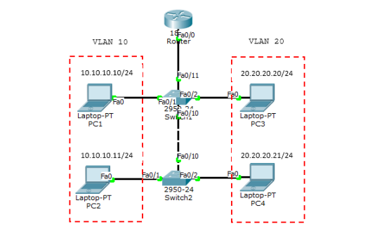

Untuk menghubungkan VLAN yang berbeda, dibutuhkan perangkat layer 3 baik itu router atau switch layer 3. Cara pertama adalah dengan menggunakan satu router melalui satu interface. Teknik ini disebut router on a stick. Kekurangan dari teknik ini adalah akan terjadi collision domain karena hanya menggunakan satu interface.

Ada 2 trunking protocol yang biasa digunakan:

- ISL = cisco proprietary, bekerja pada ethernet, token ring dan FDDI, menambahi tag sebesar 30byte pada frame dan semua traffic VLAN ditag.
- IEEE 802.11Q (dot1q) = open standard, hanya bekerja pada ethernet, menambahi tag sebesar 4byte pada frame.



Buat topologi seperti diatas dan konfigurasi VLAN10 dan VLAN20 seperti lab sebelumnya. Tambahkan 1 router. Karena hanya menggunakan 1 interface, maka harus dibuat sub-interface untuk dijadikan gateway VLAN. Port SW1 yang terhubung ke router harus diset mode trunk.

```yml
Router(config)#interface FastEthernet0/0.10
Router(config-subif)#encapsulation dot1Q 10
Router(config-subif)#ip address 10.10.10.1 255.255.255.0
Router(config-subif)#interface FastEthernet0/0.20
Router(config-subif)#encapsulation dot1Q 20
Router(config-subif)#ip address 20.20.20.1 255.255.255.0
```

Cek interface dengan perintah show ip int brief.

```yml
Router#sh ip int br
Interface IP-Address OK? Method Status
Protocol
FastEthernet0/0 unassigned YES unset up up
FastEthernet0/0.10 10.10.10.1 YES manual up up
FastEthernet0/0.20 20.20.20.1 YES manual up up
FastEthernet0/0.30 30.30.30.30 YES manual up up
FastEthernet0/1 unassigned YES unset administratively down down
Vlan1 unassigned YES unset administratively down down
Router#
```

Sekarang ping antar VLAN yang berbeda.

```yml
PC>ping 20.20.20.21
Pinging 20.20.20.21 with 32 bytes of data:
Request timed out.
Reply from 20.20.20.21: bytes=32 time=1ms TTL=127
Reply from 20.20.20.21: bytes=32 time=0ms TTL=127
Reply from 20.20.20.21: bytes=32 time=0ms TTL=127
Ping statistics for 20.20.20.21:
Packets: Sent = 4, Received = 3, Lost = 1 (25% loss),
Approximate round trip times in milli-seconds:
Minimum = 0ms, Maximum = 1ms, Average = 0ms
PC>tracert 20.20.20.21
Tracing route to 20.20.20.21 over a maximum of 30 hops:
 1 30 ms 0 ms 0 ms 10.10.10.1
 2 0 ms 0 ms 0 ms 20.20.20.21
Trace complete.
Router#sh ip arp
Protocol Address Age (min) Hardware Addr Type Interface
Internet 10.10.10.10 4 0000.0C1B.0D20 ARPA
FastEthernet0/0.10
Internet 20.20.20.21 3 0060.7092.05A9 ARPA
FastEthernet0/0.20
Internet 30.30.30.1 1 0001.C7AE.3D52 ARPA
FastEthernet0/0.30
Router#
```
