Adalah suatu diagram yang menggambarkan susunan logika suatu program Simbol simbol yang digunakan adalah sebagai berikut :

| Simbol                       |        Nama Simbol         |                                                    Keterangan                                                    |
| :--------------------------- | :------------------------: | :--------------------------------------------------------------------------------------------------------------: |
| 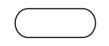     |          Terminal          |             sebagai awal (berisi ‘Start’/’Mulai’) dan sebagai akhir (berisi ‘End’/’Stop’/’Selesai’).             |
| 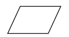 |        Input/Output        |                           Membaca masukan (input) atau menampilkan keluaran (output).                            |
| 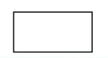       |     Proses/Prosessing      |                               Mengolah data melalui operasi aritmatika dan logika.                               |
| 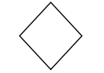     | Decision/(kotak keputusan) | Berfungsi untuk memutuskan arah/percabangan yang diambil sesuai dengan kondisi yang dipenuhi, yaitu Benar/Salah. |
| 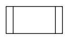     |    Subroutine/subrutin     |                        Untuk menjalankan proses suatu bagian (sub program) atau prosedur.                        |
| 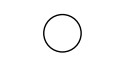     |     On page Connector      |    untuk menghubungkan diagram alur yang terputus dimana bagian tersebut masih berada pada halaman yang sama.    |
| 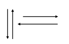     |     Flowline/Alur data     |                                      Bagian arah instruksi yang dijalankan.                                      |
| 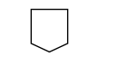     |     Off page Coneector     |    Menghubungkan sambungan dari bagian flowchart yang terputus dimana sambungannya berada pada halaman lain.     |
| 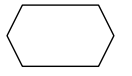  |        Preparation         |                                      Digunakan untuk pemberian harga awal.                                       |

# Diagram Alir Program Komputer

Pada dasarnya suatu program komputer umumnya terdiri atas :

1. Pembacaan / pemasukan data ke dalam komputer
2. Melakukan komputasi/perhitungan terhadap data tersebut
3. Mengeluarkan / mencetak/ menampilkan hasilnya.

## Flowchart terdiri dari tiga struktur

1. Struktur Sequence / Struktur Sederhana Digunakan untuk program yang instruksinya sequential atau urutan

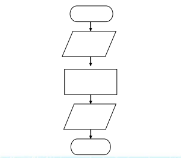

## Contoh Flowchart Struktur Squence Menghitung Luas Segitiga

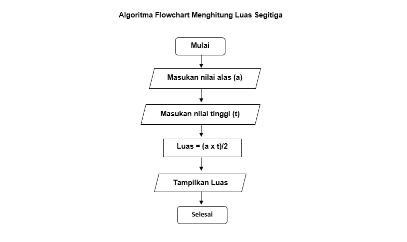

### Menggunakan Tabel Penyimpanan

Tabel 1. Media Penyimpanan Sequence 1

| Perintah  |  A  |  B  | Output |
| :-------- | :-: | :-: | :----: |
| A <- 10   | 10  |     |        |
| A <- 2\*A | 20  |     |        |
| B <- A    |     | 20  |        |
| Write(B)  |     |     |   20   |

Tabel 2. Media Penyimpanan Sequence 2

| Perintah     |  X  |  Y  |  Z  | Output |
| :----------- | :-: | :-: | :-: | :----: |
| X <- 100     | 100 |     |     |        |
| Y <- X-25    |     | 75  |     |        |
| Z <- Y/5     |     |     | 15  |        |
| X <- X/(Z+5) |  5  |     |     |        |
| Write(X,Y,Z) |     |     |     |        |

# Menjumlahkan Dua Bilangan Positif

Membuat flowchart untuk menjumlahkan dua bilangan bulat positip dan mencetak hasilnya Algoritmanya:

- Masukkan bilangan a
- Masukkan bilangan b
- Jumlahkan bilangan a dan b
- Cetak hasil jumlahnya

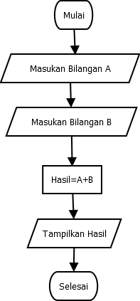

# Menentukan Bilangan Genap/Ganjil

Struktur Branching Digunakan untuk program yang menggunakan pemilihan atau penyeleksian kondisi.(contoh menentukan bilangangenap/ganjil)

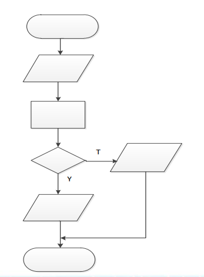

**Algoritmanya:**

1. Masukkan sebuah bilangan
2. Bagi bilangan tersebut dengan 2
3. Jika sisa pembagian = 0 maka bilangan tersebut adalah bilangan genap
4. Jika sisa pembagian = 1 maka bilangan tersebut adalah bilangan ganjil

**Pseuducode:**

```
read bilangan
If bil mod 2 = 0 then
“Bilangan Genap”
Else
“Bilangan Ganjil”
```

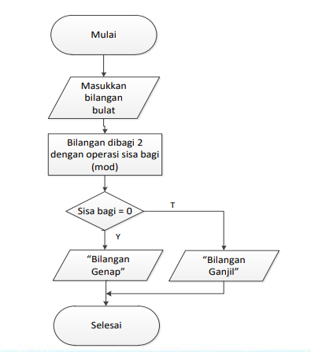

# Flowchart Perulangan

Stuktur Looping Digunakan untuk program yang instruksinya akan dieksekusi berulang-ulang.

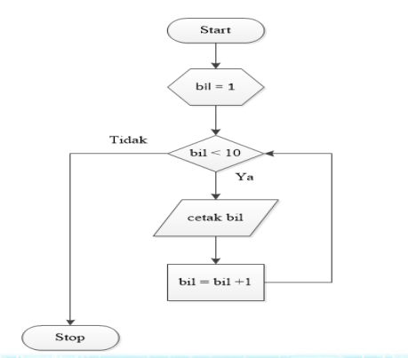
