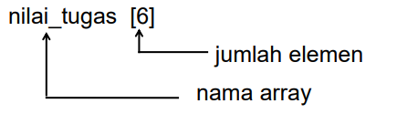
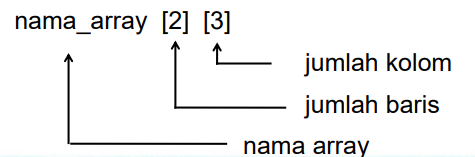
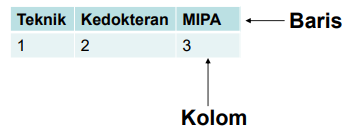
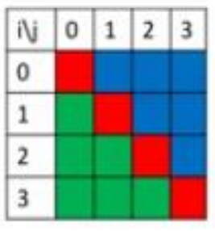
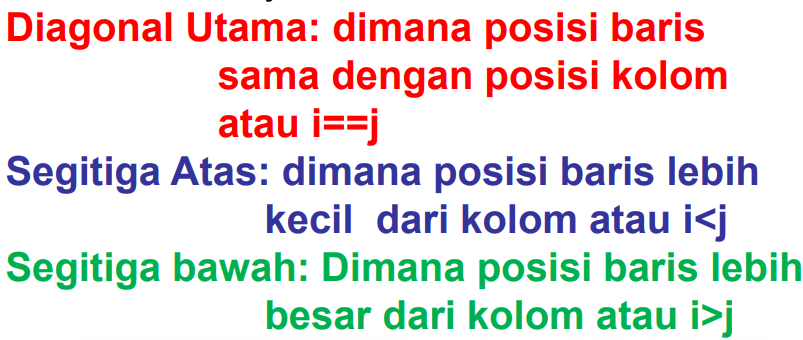

## Larik atau Array

- Array adalah Jenis variabel yang dapat digunakan untuk menyimpan sejumlah data dengan tipe yang sama (Kadir, 2017).
- Array disebut juga tabel, vektor, atau larik

## Tujuan menggunakan Array:

Dapat melakukan loop atau pengulangan melalui elemen di dalam array dengan mudah dan mengambil nilai yang diperlukan hanya dengan menentukan nomor indeks.

Setiap elemen dalam array diakses dengan membedakan indeks/subscript arraynya.  
Contoh 1:  
A[1] = 3  
A[2] = 5  
A[3] = 10

Contoh 2:  
Array of integer [1,2,3,4,5] index dimulai dari 0 sampai (n-1), dengan n adalah panjang array.

Kode program membuat dan menampilkan array:

```py
import numpy as np

a = np.array([[1, 2, 3, 4],
              [5, 6, 7, 8],
              [9, 10, 11, 12]])

print(a)

# Output
[[1  2  3  4]
 [5  6  7  8]
 [9 10 11 12]]
```

## Dimensi Array Terdiri dari:

1. Array Dimensi Satu
2. Array Dimensi Dua

### 1. Array Dimensi Satu

Sebuah variabel yang menyimpan sekumpulan data yang memiliki tipe sama dan elemen yang akan diakses hanya melalui 1 indeks atau subskrip.

Bentuk Umum:  
 `Nama_array[jumlah_elemen]`  
Contoh:



\*\*Contoh Program Array dimensi 1:

```py
nilai_tugas = [70, 80, 90, "Keterangan Lulus"]
print("Nilai Tugas:")
print(nilai_tugas)

# Output
Nilai Tugas:
[70, 80, 90, 'Keterangan Lulus']
```

### 2. Array Dimensi Dua

- Array dimensi dua atau disebut sebagai array bersarang atau nested list
- Array dimensi dua terdiri dari baris dan kolom

Bentuk Umum :  
`nama_aray[jumlah_elemen_baris] [jumlah_elemen_kolom]`  
Contoh:



**Contoh Program:**

```py
array=[["Teknik","Kedokteran","MIPA"],[1,2,3]]
print(array)

# Output
[['Teknik', 'Kedokteran', 'MIPA'], [1, 2, 3]]
```

Pada contoh Array dimensi dua maka memperlihatkan array dua dimensi dengan ukuran 2X3 dengan urutan fakultas berdasarkan tingkat kesulitannya. Baris pertama mewakili nama-nama fakultas dan kolom kedua mewakili tingkat kesulitannya.



# Matrik

- Matrik adalah Penyajian Data
- Istilah-istilah dalam matrik seperti: Ordo **(Dimensi matriks yang memuat baris dan kolom)**, elemen, baris dan kolom

Contoh: m= baris, n= kolom  
m x n:  
a<sub>11</sub> a<sub>12</sub> a<sub>13</sub>.....a<sub>1n</sub>  
a<sub>21</sub> a<sub>22</sub> ......a<sub>2n</sub> -> elemen  
a<sub>m1</sub> a<sub>m2</sub> ......a<sub>mn</sub>

2 1 2  
3 0 1 -> Ordo 3x3  
2 0 0

Hasil:

- a<sub>11</sub> = 2, a<sub>21</sub> = 3, a<sub>31</sub> = 2
- a<sub>12</sub> = 1, a<sub>22</sub> = 0, a<sub>32</sub> = 0
- a<sub>13</sub> = 2, a<sub>23</sub> = 1, a<sub>33</sub> = 0

## Matrik dalam Pemrograman Python



Dibuat seperti membuat Array 2 dimensi Biasanya diakses dengan bentuk A[i][j] dimana:

- A = nama matriks
- I = indeks baris
- J = indeks kolom  
  Terdapat 3 bagian utama pada matriks berordo sama yaitu:



### Array Dimensi Dua

Diberikan matriks A sebagai berikut :  
1 1 1 1  
0 1 1 1  
0 0 1 1  
0 0 0 1  
Perintah pokok yang digunakan pada pengisian matriks A adalah :  
**A[i,j] = 1, jika i <=j , A[i,j] = 0, jika i > j**

Program:

```py
# Deklarasi matriks 4x4
matriks = [[0, 0, 0, 0], [0, 0, 0, 0], [0, 0, 0, 0], [0, 0, 0, 0]]

# Isi matriks 4x4
for i in range(4):
    for j in range(4):
        if i == j:
            matriks[i][j] = 1
        if i < j:
            matriks[i][j] = 1
        if i > j:
            matriks[i][j] = 0

# Cetak bentuk matriks
for i in range(4):
    print(matriks[i])
```

#### Latihan

1. Diberikan matriks A sebagai berikut :  
   1 2 3 4  
   0 2 3 4  
   0 0 3 4  
   0 0 0 4  
   Perintah pokok yang digunakan pada pengisian matriks A adalah :

2. Diberikan algoritma sebagai berikut:

```py
nilai = [1, 2, 3, 4]

for i in range(len(nilai)):
    nilai[i] = 2 * i + 1
    print(nilai[i])
```

Algoritma di atas akan menghasilkan nilai..
