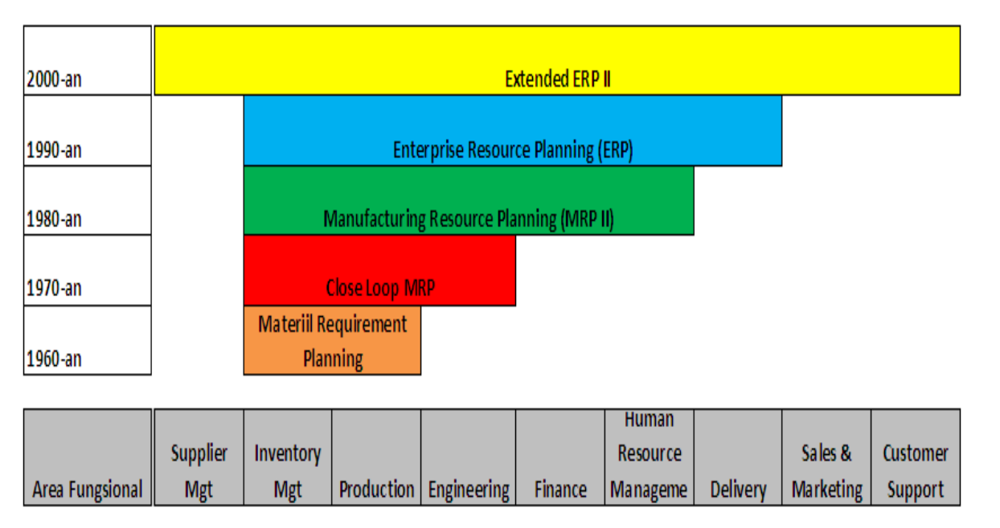
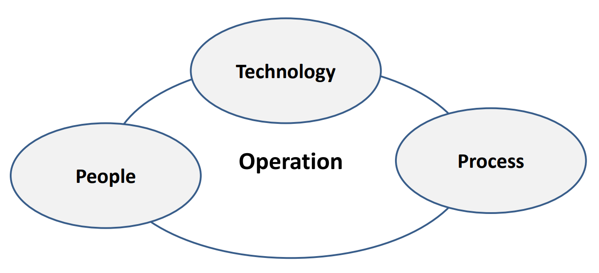

## Sejarah Sistem ERP

| Tahun         | Peristiwa                                                                                                                                                                                                                                                              |
| ------------- | ---------------------------------------------------------------------------------------------------------------------------------------------------------------------------------------------------------------------------------------------------------------------- |
| 1960-an       | Sistem Fabrikan fokus kepada pengendalian Inventory (Inventory Control)                                                                                                                                                                                                |
| 1970-an       | Fokus bergeser pada MRP (Material Requirement Planning) yang menerjemahkan jadwal Utama suatu produk menjadi kebutuhan berbasis timephased net, untuk perencanaan dan pengadaan barang sebagian jadi, komponen maupun bahan baku                                       |
| 1980-an       | MRP-II (Manufacturing Resource Planning) berkembang mencakup pengelolaan operasi (shop floor) dan aktivitas pengelolaan distribusi                                                                                                                                     |
| 1990-an       | MRP –II dikembangkan lagi mencakup aktivitas rekayasa, keuangan, sumber daya manusia, pengelolaan proyek yang melingkupi hampir semua aktivitas sistem organisasi usaha (business enterprise), yang kemudian dikenal dengan istilah Enterprise Resource Planning (ERP) |
| 2000-sekarang | Enteded ERP menjadi ERP II                                                                                                                                                                                                                                             |

## Tahapan Evolusi Sistem ERP

## Materiil Requirement Planning

MRP digunakan untuk melakukan simulasi persamaan industri manufaktur, dengan menggunakan jadwal perencanaan (master schedule) untuk menjawab produk apa yang akan diproduksi, daftar pengadaan material (bill of material) untuk menjawab bahan material yang diperlukan untuk membuat produk, daftar saldo persediaan untuk menjawab bahan material apa yang sudah dimiliki dan bahan material yang harus dibeli.

## Close Loop MRP

Alat bantu berupa sistem untuk mendukung perencanaan hingga penjualan dan produksi (Sales and Distributor Planning), jadwal pembuatan produk (Master Schedulling), perkiraan perencanaan penjualan dan perencanaan order konsumen (Demand Management), serta analisa sumber daya

## Ruang Lingkup Close Loop MRP


graph TD

    A[Demand Management]
    B[Production Planning]
    C[Master Scheduling]
    D[Material Requirements]
    E[Plant & Supplier Scheduling]
    F[Execution]
    G[Capacity Planning]

    %% Alur utama
    A <--> B
    A <--> C
    A <--> E

    B <--> G
    C <--> G
    D <--> G
    E <--> G

    C <--> D
    D <--> E
    C <--> E

    E <--> F



## Manufacturing Resource Planning (MRP II)

Sama seperti tahap sebelumnya, hanya ada penambahan elemen sebagai berikut :

1. Perencanaan penjualan dan operasi, proses yang digunakan untuk menyeimbangkan antara permintaan dan persediaan, sehingga management dapat melakukan kontrol terhadap aspek operasional dan bisnis.
2. Antarmuka keuangan, kemanpuan menerjemahkan rencana operasional (satuan bentuk pieces, kg, gallon,satuan lainnya) menjadi satuan biaya(dalam mata uang tertentu).
3. Simulasi kemampuan melakukan analisis “what if” untuk mendapatkan jawaban yang mungkin diterapkan, baik dalam satuan unit maupun dalam jumlah uang.

## Enterprise Resource Planning (ERP)

Dasar ERP diturunkan dari MRP II, tetapi proses bisnisnya diperluas dan lebih sesuai diterapkan pada kondisi perusahaan yang memiliki beberapa unit bisnis. Dengan sistem ERP, maka integrasi keuangan lebih ditekankan, alat bantu rantai – pasok, dukungan atas bisnis melintas batas fungsi organisasi, bahkan melintas antar perusahaan dapat dilakukan dengan mudah. Tujuan utama implementasi ERP adalah agar perusahaan dapat menjalankan bisnis dalam kondisi yang cepat berubah dan sangat kompetitif, dan jauh lebih baik dari sebelumnya.

## Extended ERP II

Perluasan dari fungsi- fungsi yang ada pada system ERP, yaitu mencakup fungsi-fungsi yang dapat menjembatani komunikasi dengan suplier dan konsumen. Sistem ini tidak hanya berfokus pada konsumen, proses produksi, transaksi real time, management asset perusahaan, bahkan berfokus pada usaha optimasi seluruh jaringan bisnis, termasuk integrasi dengan supplier

## Perbandingan ERP dan ERP II

| Aspek      | ERP                                                          | ERP II                                                                                                                                |
| ---------- | ------------------------------------------------------------ | ------------------------------------------------------------------------------------------------------------------------------------- |
| Peranan    | Optimasi Enterprise                                          | Partisipasi elemen pada rantai bisnis proses perusahaan, dukungan penuh e-commerce                                                    |
| Domain     | Manufaktur dan Distribusi                                    | Semua segmen dan sektor pada perusahaan                                                                                               |
| Fungsi     | Produksi, Penjualan, Distribusi dan Proses Keuangan          | Lintas Industri, Sektor tertentu, proses industri spesifik                                                                            |
| Proses     | Menangani proses nternal, tertutup erhadap proses ksternal   | Terhubung dengan mitra bisnis                                                                                                         |
| Arsitektur | Dukungan pada web, tertutup, arsitektur bersifat monopolitik | Berbasis web, terbuka,fleksibel terhadap integrasi dengan sistem lain dengan berbasis komponen                                        |
| Data       | Dihasilkan dan dikonsumsi oleh internal perusahaan           | Dihasilkan dan dikonsumsi oleh pihak internal dan eksternal perusahaan dan hasilnya dipublikasikan ke semua pihak yang berkepentingan |

## Infrastruktur sistem ERP

## Karakteristik Sistem ERP

Menurut daniel O’leary adalah sebagai berikut :

1. Paket perangkat lunak yang didesain untuk lingkungan pelanggan pengguna server, apakah secara tradisional atau berbasis jaringan.
2. Memadukan sebagian besar dari proses bisnis.
3. Memproses sebagian besar dari transaksi perusahaan.
4. Menggunakan database perusahaan secara tipikal menyimpan setiap data sekali saja.
5. Memungkinkan akses data secara real time.
6. Memungkinkan perpaduan proses transaksi dan kegiatan perencanaan.
7. Menunjang sistem multi mata uang dan bahasa, yang sangat diperlukan perusahaan multinasional.
8. Memungkinkan penyesuaian untuk kebutuhan khusus perusahaan tanpa melakukan pemrograman kembali.

Menurut Daniel O’Leary :

- Paket perangkat lunak yang didesain untuk lingkungan pelanggan pengguna server, apakah secara tradisional atau berbasis jaringan
- Memadukan sebagian besar dari proses bisnis
- Memproses sebagian besar dari transaksi perusahaan
- Menggunakan database perusahaan yang secara tipikal menyimpan setiap data sekali saja
- Memungkinkan akses data secara real time
- Memungkinkan perpaduan proses transaksi dan kegiatan perencanaan
- Menunjang sistem multi mata uang dan bahasa, yang sangat diperlukan perusahaan multiinasional
- Memungkinkan penyesuaian untuk kebutuhan khusus perusahaan tanpa melakukan pemrograman kembali

## Manfaat Sistem ERP

Menurut james A O’brien adalah sebagai berikut :

1. Kualitas dan Efisiensi
2. Penurunan Biaya.
3. Pendukung Keputusan.
4. Kelincahan Perusahaan.
5. Sistem Terintegrasi
6. Sistem ERP tidak hanya memadukan data dan orang
7. Sistem ERP dapat memungkinkan management mengelola operasi.
8. Sistem ERP dapat memudahkan ekstrasi informasi.
9. Sistem ERP menghasikan informasi
10. Sistem ERP menciptakan struktur organisasi.
11. Sistem ERP menjamin seluruh aktivitas.
12. Sistem ERP mengendalikan seluruh proses bisnis.

## Konsep ERP

Enterprise Resource Planning(ERP) merupakan singkatan dari tiga elemen kata Enterprise (Perusahan/Organisasi), Resource (Sumber Daya), Planning(Perencanaan). Jadi Enterprise Resource Planning (ERP) merupakan konsep untuk merencanakan dan mengelola sumber daya perusahaan , yaitu berupa paket aplikasi program terintegrasi dan multi modul yang dirancang untuk melayani dan mendukung berbagai fungsi dalam perusahaan (to serve and support multi business functions), sehingga pekerjaan menjadi lebih efisien dan dapat memberikan pelayanan lebih bagi konsumen, yang akhirnya dapat menghasilkan nilai tambah dan memberikan keuntungan maksimal bagi semua pihak yang berkepentingan(stake holder) atas perusahaan

1. ERP terdiri atas paket software komersial yang menjamin integrasi yang mulus atas semua aliran informasi diperusahaan, yang meliputi keuangan, akuntansi, sumber daya manusia, rantai pasok dan informasi konsumen.
2. Sistem ERP adalah paket sistem informasi yang dapat dikonfigurasi, yang mengintegrasikan informasi dan proses yang berbasis informasi di dalam dan melintas area fungsional dalam sebuah organisasi
3. ERP merupakan satu basis data, satu aplikasi dan satu kesatuan antar muka diseluruh enterprise


flowchart TB

    ES([ENTERPRISE SYSTEM])

    FA[Financial & Accounting]
    CRM[Customer Relationship Management]
    HR[Human Resource]
    INV[Inventory]
    SD[Sales & Distributor]
    BI[Business Intelligence]
    MFG[Manufacturing]
    PROC[Procurement]
    PM[Plant Maintenance]

    %% Relasi dari pusat
    ES --> FA
    ES --> CRM
    ES --> HR
    ES --> INV
    ES --> SD
    ES --> BI
    ES --> MFG
    ES --> PROC
    ES --> PM



## Scope of Financial Dan Accounting

- Cost Center and Profit Center
- Account Payable
- Account Receivable
- Cash/ Bank Management (Cash Flow Management)
- Treasury Management
- General Ledger(Income Statement & Balance Sheet)
- Sales Quotation
- Sales Order
- Shipping
- Good Issue
- Invocing
- Credit Control
- Komisi,Discount,Creadit Notes

## Scope of Manufacturing

- Order Production
- Bill of Material
- Planning Producting Control –Order Production
- Master Planning
- Schedulling
- MRP(material requirement planning)
- Product costing

## Scope of Inventory

- Inventory Movement(transfer)
- Inventory Management
- Multiple Warehouse Location
- Product Category
- Product Items
- Physical and Valuation Inventory

## Procurement

- Purchase Requisition and Approval
- Purchase Order and Approval
- Good Receipt
- Invoice Verification
- Purchase Return

## Scope of Human Resource

- Employee Schedulling
- Training
- Development Employement
- Payroll,Benefit,Bonut,Overtime
- Job Description
- Self Service HR
- Struktur Organisasi and Workflow analysis

## Scope of Plant

- Reduce operational budged on production
- Increase for Efficiency (work clearance management, maintenance execution,service part,document management, maintenance budgeting and integration with accounting assets)

## Scope of Customer Relationship Management

- Customer Campaign
- Customer Interaction Center
- Customer Self Service Online Inquiry
- Lead and Activity Tracking(Information, Service, Charge,Account, Warranty,help)
- Knowledge base, Sales Report,Sales Support, Sales Qualification
- Consistent user experience
- Personalization of Service
- Realtime access enterprise info

## Ruang Lingkup Businness Intelligence

- Sistem informasi untuk pengambilan keputusan bagi management, seperti Decision Support Sistem(DSS),yang Inovatif dan Intuitif Interface untuk kepentingan analisis data transaksi agar memperoleh kinerja bisnis

- Merupakan proses interaktif untuk eksplorasi dan analisis informasi yang terstruktur dan pada domain tertentu(data warehouse)untuk mengetahui pola bisnis tertentu, sehingga membantu pengambilan keputusan
