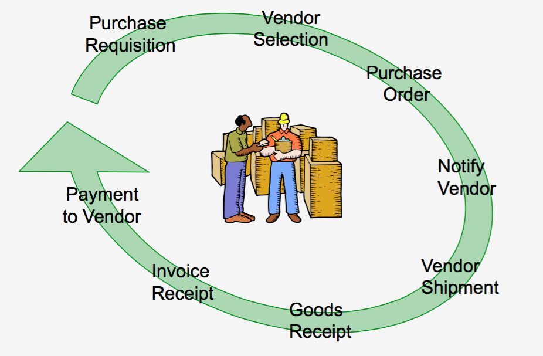
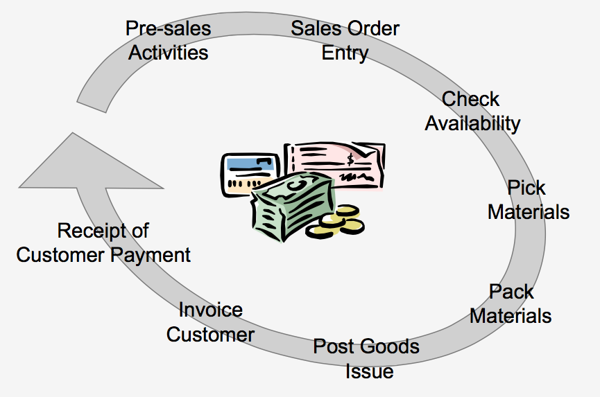

## Procurement

Siklus sistem procurement dimulai dari aktivitas pembuatan pembelian(purchase requisition) dari departemen. Setelah form permintaan disetujui oleh atasan departemen terkait dan disampaikan ke departemen pembelian, maka petugas departemen pembelian akan melakukan pemilihan pihak pemasok negosiasi harga, dan kemudian diterbitkan pesanan pembelian (purchase order) sebagai bukti bahwa perusahaan telah menyetujui proses pembelian kepada pihak pemasok. Kemudian proses penerimaan barang(good receipt) oleh gudang berdasarkan pesanan pembelian tersebut. Berdasarkan kesepakatan, maka pemasok melakukan penagihan yang disertai faktur, faktur pajak untuk proses pembayaran. Proses verifikasi penagihan (invoice verification) oleh departemen keuangan. Setelah itu, dilakukan proses pembayaran kepada pemasok sebagai bukti pelunasan atas barang yang dibeli

### Siklus sistem procurement

### Laporan dari Procurement

- Laporan status permintaan pembelian
- Laporan status pesanan pembelian
- Laporan pembelian
- Laporan retur pembelian
- Laporan kontrol pembelian

## Sales and Distribution

Siklus manajemen penjualan dimulai dari kegiatan presales(sales contract) yaitu negosiasi hatrga dengan pihak pelanggan yg kemudian disertai dengan pembuatan penawaran harga(quotation). Kemudian dilanjutkan dengan pemrosesan order penjualan (sales order). Sekarang ini, penerapan sistem ERP ini dapat dilakukan menggunakan web based. Setelah itu, administrasi penjualan mengecek persediaan barang digudang, untuk menyediakan barang yang diperlukan untuk memenuhi order penjualan. Hal ini dikenal dengan istilah Inventory Sourcing.

Setelah barang tersedia, maka dilakukan proses shipping yaitu aktivitas mengirimkan barang ke tempat pelanggan dengan pembuatan surat jalan(SJ) dan Delivery Order(DO). Kemudian dilanjutkan dengan aktivitas billing yaitu proses pembuatan faktur komersial, faktur pajak, kwintansi yg disampaikan ke pelanggan untuk proses penagihan. Berdasarkan tagihan tersebut, pelanggan melakukan pembayaran, jika dilihat dari segi perusahaan , akan dilakukan proses penerimaan atas nilai piutang pelanggan (receipt account receivable)

### Siklus Sales and Distribution

### Kegunaan Sales and Distribution

- Meningkatkan pelayanan terhadap kepuasan pelanggan, yaitu mempercepat proses peneriamaan pesanan sampai pengiriman barang dengan tepat waktu
- Memberikan informasi penjualan dan Analisa penjualan yang dibutuhkan pihak pelanggan
- Membuat perencanaan penjualan untuk perhitungan kebutuhan bahan material, perencanaan pembelian dan produksi barang dimasa depan

### Karakteristik Modul Sales and Distribution

- Fasilitas mengelola dan penginputan kontrak penjualan dan order penjualan
- Fasilitas overdue limit kredit, untuk pembatasan order penjualan terhadap saldo piutang yang sudah jatuh tempo tapi belum dilakukan pembayaran oleh dihak pelanggan
- Fasilitas untuk penginputan transaksi penjualan dalam multi curency
- Fasilitas delivery schedule untuk membuat delivery order berdasarkan sales order yg segera harus dikirim dgn memperhitungkan jumlah saldo persediaan di gudang
- Fasilitas delivery order untuk transaksi pengiriman barang tepat waktu
- Fasilitas sales invoice (faktur komersial, faktur pajak,kwitansi) secara otiomatis untuk proses penagihan ke pelanggan
- Fasilitas sales return untuk transaksi pengembalian barang (return jual) dari pelanggan dengan alas an tertentu

Dalam aktivitas sales dan distribusi, system informasi dituntut untuk semakin fleksibel,user friendly yang canggih, agar mampu mengikuti dan menangani berbagai perubahan dan keadaan tertentu secara tepat dan cepat, seperti : proses perubahan harga,alokasi persediaan,fleksibel penggunaan sistem barcode, mendukung kegiatan promosi, ketepatan Waktu pengiriman dan pengecekan batas plafond kredit

### Laporan dari Sales and Distribution

- Laporan Sales Kontrak dan Outstanding Sales Kontrak
- Laporan Sales Order dan Outstanding Sales Order
- Laporan Penjualan
- Laporan Analisa Penjualan
- Laporan Retur penjualan
- Laporan Delivery Update
- Laporan Komisi Sales person
- Laporan Kredit Pelanggan
- Laporan Gross Profit

## Finance dan Accounting

Pada sistem ERP, untuk penyusunan laporan keuangan dilakukan melalui aplikasi program General Ledger. Semua data transaksi diperoleh dari sistem proses transaksi lainnya, seperti :

- Sales transaction processing sistem : sales order processing, billing, sales analysis
- Purchases transaction processing sistem : purchases, inventory, processing
- Cash receipt and Disbursement transaction processing sistem : account receivable, cash receipts, account payable, cash disbursement
- Payroll transaction processing sistem : payroll, time keeping


flowchart LR

    %% ======================
    %% SALES SYSTEM (KIRI)
    %% ======================
    subgraph S1[Sales Transaction Processing System]
        SOP[Sales Order Processing]
        BILL[Billing]
        SA[Sales Analysis]

        SOP --> BILL
        SOP --> SA
    end

    %% ======================
    %% CASH SYSTEM (TENGAH ATAS)
    %% ======================
    subgraph S2[Cash Receipts and Disbursements Transaction Processing System]
        AR[Accounts Receivable]
        CR[Cash Receipts]
        AP[Accounts Payable]
        CD[Cash Disbursements]

        CR --> AR
        CD --> AP
    end

    %% ======================
    %% GENERAL LEDGER (KANAN ATAS)
    %% ======================
    subgraph S3[General Ledger Processing and Reporting System]
        GL[General Ledger]
        FR[Financial Reporting]

        GL --> FR
    end

    %% ======================
    %% PURCHASES SYSTEM (BAWAH TENGAH)
    %% ======================
    subgraph S4[Purchases Transaction Processing System]
        PUR[Purchases]
        INV[Inventory Processing]

        PUR --> INV
    end

    %% ======================
    %% PAYROLL SYSTEM (KANAN BAWAH)
    %% ======================
    subgraph S5[Payroll Transaction Processing System]
        TK[Timekeeping]
        PAY[Payroll]

        TK --> PAY
    end

    %% ======================
    %% KONEKSI ANTAR SISTEM (NGIKUT GAMBAR)
    %% ======================

    %% Sales ke Cash
    BILL --> AR

    %% Cash ke General Ledger
    CR --> GL
    CD --> GL

    %% Purchases ke Cash
    PUR --> AP

    %% Inventory ke General Ledger
    INV --> GL

    %% Payroll ke General Ledger
    PAY --> GL

    %% (opsional tambahan dari gambar: garis atas panjang)
    BILL --> GL

    SOP --> INV

    

## General Ledger

General ledger merupakan jantung dari sistem informasi accounting karena akan dihasilkan laporan keuangan(financial reporting) untuk mengetahui kondisi keuangan suatu perusahaan spt laporan neraca, laporan laba rugi, laporan analisa rasio keuangan dan laporan keuangan lainnya. Kegunaan general ledger yaitu :

- Fasilitas multi currency bagi kode perkiraan yang mempunyai mata uang equvalensi dalam mata uang asing
- Fasilitas jurnal berulang untuk mempermudah dan mempercepat entry transaksi untuk transaksi yang berulang
- Tersedia fasilitas budget yang dapat dibandingkan dengan actual secara cepat dan mudah
- Penyajian laporan keuangan secara otomatis(automatic reporting
- Sistem pelaporan yang bertingkat dan informatif
- Dapat menyimpan data untuk periode yang tak dibatasi dan hanya dibatasi oleh kapasitas hard disk yang digunakan
- Dirancang sedemikian rupa, sehingga build un early warning sistem pada saat penginputan transaksi maupun pada saat penyimpanan transaksi
- Fasilitas posting dan unposting per periode, sehingga memudahkan jika terjadi kekeliruan data pada periode sebelumnya dapat dilakukan proses unposting general ledger

Laporan yang dihasilkan yaitu :

- Laporan neraca dan laporan rugi
- Laporan rincian dan highlight laporan keuangan
- Laporan rincian biaya per pusat beban
- Laporan rincian saldo perkiraan
- Laporan kartu buku besar
- Laporan neraca saldo
- Laporan daftar jurnal transaksi

## Inventory

Melalui model inventory, maka akan dapat dikendalikan persediaaan bagi perusahaan, sehingga dapat meminimalkan tingkat persediaan, dimana akan berdampak terhadap penggunaan modal kerja yang dapat digunakan untuk menumpuk jumlah persediaan menjadi lebih rendah tanpa harus menganggu kelancaran proses produksi. Juga dapat mengurangi tingkat kerugian persediaan yang tak terpakai lagi (obselence), rusak(damage) dan persediaan yang kadaluarsa (expired date)

### Alasan perlu adanya inventory

- Dapat memenuhi kebutuhan pelanggan pada waktu tertentu
- Mengambil keuntungan ketika ada potongan harga dari pihak pemasok
- Menghindari dari fluktuasi harga meningkat
- Menyediakan persediaan cadangan (buffer) untuk kondisi permintaan yang tidak menentu
- Menjaga kelangsungan proses produksi

### Klasifikasi Inventory

- Raw material
- Work in process
- Finished goods

### Raw Material

Merupakan bahan dasar dari suatu industri yang digunakan untuk memproduksi barang siap jual ke pihak pelanggan. Tapi hal ini tergantung dari jenis perusahaan masing - masing, dimana raw material diperusahaan dapat menjadi sebagai Finished goods dari perusahaan lainnya

### Work in process

Merupakan inventory yang sudah diolah untuk diproses menjadi barang jadi (Finished goods), yang masih setengah jadi (dalam proses penyelesaian). Dalam perusahaan industri manufaktur, maka proses Work in process memerlukan biaya proses mesin, bahan pembantu, tenaga kerja.

### Finished goods

Merupakan barang yang siap dikirim atau siap dijual kepada pihak pelanggan. Dalam manufaktur, maka Finished goods merupakan barang dari proses terakhir yang disimpan dalam gudang untuk siap dijual ke pihak pelanggan.

### Just In Time

Inventory identik dengan menumpukan sejumlah uang atau investasi yang akan menganggu cash flow suatu perusahaan, terlebih jika inventory tersebut tidak bergerak. Just in Time adalah metode yang digunakan untuk menanganan sistem inventory, dimana manfaatnya sbb:

1. Inventory berkurang, sehingga investasi dalam inventory berkurang, yang akhirnya akan mempengaruhi kinerja keuangan perusahaan
2. Barang yg kadaluarsa (obsolete inventory) akan lebih sedikit
3. Kualitas inventory akan meningkat
4. Mengurangi proses inspeksi dan pengerjaan Kembali
5. Deteksi inventory yang cepat jika terjadi cacat inventory yang diakibatkan proses produksi
6. Biaya penanganan inventory mengalami penurunan seperti hand-ling cost, carrying cost
7. Kebutuhan ruangan atau gudang berkurang, shg dpt meminimalisasi invetasi gudang
8. Lead time menjadi lebih pendek
9. Produktivitas meningkat
10. Fleksibilitas lebih besar
11. Hubungan dengan pihak supplier menjadi lebih baik
    12.Aktivitas penjadwalan dan kontrol menjadi lebih sederhana
    13.Kapasitas meningkat
    14.Penggunaan SDM menjadi lebih edisien
    15.Lebih banyak variasi produk
    16.Kepuasan pelanggan menjadi lebih besar
    17.Respon yang lebih cepat terhadap pesanan pelanggan

## Karakteristik Modul Inventory

1. Fasilitas Inventory Adjusment, untuk melakukan koreksi persediaan yang terjadi karena kerusakan, selisih stock, penyusutan, penguapan dsb
2. Fasilitas Inventory Transfer, untuk mencatat proses perpindahan/ mutasi stock antar gudang, perubahan jenis produk, serta laporan dan analisa persediaan yang berguna untuk memudahkan pengendalian persediaan
3. Fasilitas stock validation, untuk pengendalian stock minus, dimana dilakukan validasi transaksi inventory agar tidak melebihi stock yang tersedia
4. Fasilitas perhitungan inventory turn over (tingkat perputaran persediaan)per item persediaan
5. Fasilitas perhitungan rata – rata pemakaian per item persediaan yang digunakan dalam operasi perusahaan
6. Fasilitas kuantitas minimum inventory untuk item persedian yang dihitung berdasarkan Average Usage, Lead Time dan jumlah hari yg dipenuhi
7. Fasilitas grouping level dari pergerakan persediaan of movement(slow moving, middle moving, fast moving)
8. Fasilitas multi warehouse, untuk mencatat persediaan dengan banyak lokasi gudang yg berbeda – beda
9. Fasilitas posting dan unposting per-periode, shg memudahkan jk terjadi kekeliruan data pd periode sebelumnya dpt dilakukan proses un posting inventory, dgn otorisasi tertentu

Implemetasi motode sistem inventory Just In Time dpt berjalan baik, bila didukung dan dijalankan dgn system ERP, dmn terintegrasi dgn Master Production Schedule (MPS) dan Master Requirement Planning (MRP) dlm merencanakan kebutuhan produksi untuk pembuatan permintaan pembelian material yg diteruskan dgn pembuatan PO. Proses ini tentunya berkaitan dgn Bill Of Material (BOM)

## Laporan yang dihasilkan

- Laporan data history persediaan
- Informasi harga beli dan harga jual persediaan
- Laporan penerimaan persedian
- Laporan pengeluaran persediaan
- Kartu persediaan
- Laporan stock dan mutasi persediaan
- Laporan status persediaan
- Laporan perubahan jenis produk, koreksi persediaan, retur pengeluaran persediaan
