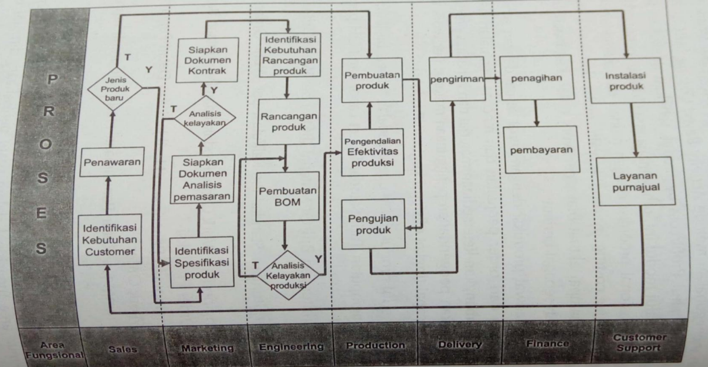

## Produksi dan Operasi

Hal utama dalam produksi dan operasi adalah perencanaan produksi, perencanaan (forecasting) yg akurat kebutuhan bahan dari sales order yang diterima, dan perbandingan standar costing dengan actual cost(accounting)

Pendekatan penyusunan perencanaan produksi agar menjadi akurat, maka harus didasarkan pada forecasting penjualan untuk periode tertentu dan posisi persediaan. Maka dapat dilakukan demand management(permintaan manajemen) terdiri atas : perhitungan kebutuhan bahan(material requirement planning) yang diteruskan proses pembelian, scheduledetail proses produksi.

## Pendekatan Perencanaan Produksi (Production Planning) dalam sistem ERP


graph TD
A([Perencanaan Sales]) --> C[Perencanaan Sales dan Operasi]
B([Saldo Inventory]) --> C
C --> D[Permintaan Management]
D --> E[Schedule Detail]
D --> F[MRP]
E --> G([Produksi])
F --> H([Pembelian])


## Kegunaaan Modul Produksi

Mengatur jadwal produksi dengan cepat sesuai dengan schedule pengiriman dari order penjualan dan rencana penjualan dengan mempertimbangkan ketersediaan material dan kapasitas produksi

Meningkatkan pengendalian penggunaan material per work order untuk mencapai tingkat efisiensi kegiatan produksi

## Karakteristik modul produksi

- Fasilitas penginputan Tarif Standar Direct Labor dan FOH per Mesin
- Fasilitas perhitungan Bill Of Material (BOM) per Work Order Produksi
- Fasilitas perhitungan Standar Pra-Kalkulasi per Work Order Produksi
- Fasilitas penginputan Work Order Produksi dan Permintaan Barang per Work Order Produksi
- Fasilitas penginputan Penerimaan Hasil Jadi dan Detail Pemakaian Bahan per Work Order
- Fasilitas penginputan Retur Penerimaan Hasil Jadi untuk reproses produksi
- Fasilitas penginputan Koreksi Work In Process (WIP)

### Siklus Umum Proses Bisnis Perusahaan Produk Dan Jasa

### Laporan yang Dihasilkan

- Laporan Biaya Standar Pra-Kalkulasi Work Order Produksi
- Laporan Profit/Loss by Work Order Produksi (Rincian dan Summary)
- Laporan Penerimaan Hasil Jadi(perperiode,perWork Order produksi)
- Laporan Analisa Variance Bahan baku per Work Order Produksi
- Laporan Analisa Variance Pembebanan Direct Labor dan FOH per Work Order Produksi
- Laporan Proses Produksi-Kapasitas Utilisasi dan Efisiensi Mesin (Rincian dan Summary)
- Laporan WIP Status dan Summary WIP
- Laporan Outstanding per Work Order Produksi
- Laporan Summary Cost of Goods Sold per Work order Produksi
- Laporan Waste Produksi
- Laporan Pemakaian bahan per Work Order Produksi
- Laporan BOM Variance( Volume Variance, Price Variance, Usage Variance)

## Customer Relationship Manajemen

Adalah strategi yang digunakan untuk mempelajari kebutuhan dan perilaku pelanggan untuk membangun relasi yang kuat dengan pelanggan. CRM merupakan sebuah pendekatan untuk mengerti dan mempengaruhi tingkah laku pelanggan, yang dapat dilakukan melalui kemampuan berkomunikasi dalam meningkatkan pelayanan permintaan order pelanggan.

Program CRM merupakan suatu proses interaksi pelanggan dengan sistem, dimana pelanggan dapat memperoleh informasi berguna seperti : status order, kontak person in charger, fungsi sales, yang akhirnya bertujuan untuk dapat meningkatkan hubungan baik dengan pelanggan

Solusi CRM adalah penyediaan informasi yang dibutuhkan untuk mendukung program penjualan, pelayanan, dan pemasaran. Manfaat CRM dapat berupa penyederhanaan proses bisnis, meningkatkan kualitas dan akurasi data, menyediakan akses bagi pengguana atau unit bisnis terhadap sumber daya yang sama

### Manfaat CRM

- Menyediakan layanan pelanggan yang lebih baik
- Membuat all center yang lebih efisien
- Menyederhanakan proses pemasaran dan penjualan
- Mendapatkan pelanggan baru
- Mengetahui secara detail pelanggan dan pelanggan yang baik
- Mengetahui produk yg dibutuhkan pelanggan dan produk yang tidak dibutuhkan pelanggan
- Mengetahui kapan waktu dan bagaimana pelanggan membeli
- Mengetahui karakteristik pelanggan
- Mengidentifikasi dan menggolongkan level pelanggan
- Mengetahui memperkirakan produk yang akan dibeli pelanggan
- Mengetahui untuk membina hubungan baik dengan pelanggan untuk waktu yang akan dating

### Keuntungan CRM menurut Efraim Turban

- Biaya yang relatif rendah dalam merekrut calon pelanggan
- Tidak memerlukan pelanggan yang banyak dalam melakukan pemeliharaan proses bisnis yang terus menerus (steady business volume)
- Meningkatkan perluasan segmentasi dan target penjualan dan pelayanan, sehingga memperoleh keuntungan dengan jumlah pelanggan yang besar
- Meningkatkan tingkat loyalitas pelanggan
- Meningkatkan pelayanan terhadap pelanggan
- Melakukan evaluasi terhadap pembelian pelanggan dan bagaimana dapat menciptakan produk baru
- Melakukan perpindahan dari fokus produk ke fokus pelanggan

### Usaha agar CRM dalam IT Development

- Kebutuhan persiapan termasuk alokasi Waktu dan uang, membangun tujuan yang realistik, dan memperoleh komitmen dari top manajemen
- Penyesuaian proses bisnis berjalan
- Pelatihan dan keterlibatan aktif tiap pengguna
- Yakinkan tingkat integrasi system

### Ukuran Tingkat Keberhasilan CRM

- Mengurangi pembuatan laporan
- Mengurangi biaya dalam melakukan proses bisnis
- Meningkatkan tingkat kepuasan pelanggan eksternal
- Meningkatkan produktivitas kerja
- Meningkatkan penjualan

### Laporan yang Dihasilkan

- Layanan dan dukungan untuk pelanggan
- Laporan Customer Interaction
- Laporan Customer Self Service online inquiry
- Lead and Activity trancking
- Laporan Sales
- Laporan Sales Support
- Laporan Sales Qualification

## Sumber Daya Manusia

Fungsi management SDM adalah melibatkan perekrutan, penempatan,evaluasi, kompensasi,dan pengembangan karyawan dari suatu organisasi.

Tujuan dari management SDM adalah penanganaan SDM yang efektif dan efisien dalam perusahaan.

Sistem SDM dirancang untuk mendukung perencanaan untuk memenuhi kebutuhan personel perusahaan, mengembangkan potensi karyawan, mengendalikan semua kebijakan dan program personel.

## Human Resource Information System (HIRS)

HRIS dapat mendukung penggunaan yang strategis, taktis dan operasional dalam SDM suatu organisasi yang meliputi:

a. Perekrutan, pemilihan dan pemberian pekerjaan
b. Penempatan kerja
c. Penilaian kinerja
d. Analisis manfaat karyawan
e. Pelatihan dan pengembangan karyawan
f. Kesehatan, keselamatan dan keamanan karyawan

## Sistem Informasi SDM


flowchart TD
%% --- Header Kolom ---
H0[" "] ~~~ H1["KEPEGAWAIAN"]
H1 ~~~ H2["PENGEMBANGAN"]
H2 ~~~ H3["KOMPENSASI"]

    %% Menyelaraskan Header dengan Baris 1
    H1 ~~~ K1
    H2 ~~~ P1
    H3 ~~~ C1

    %% --- Baris 1: Sistem Strategis ---
    L1["SISTEM STRATEGIS"] ~~~ K1["• Perencanaan SDM • Penelusuran tenaga kerja"]
    K1 ~~~ P1["• Perencanaan suksesi • Perencanaan   Penilaian Kinerja"]
    P1 ~~~ C1["• Biaya Kontrak • Perkiraan gaji"]

    %% --- Baris 2: Sistem Taktis ---
    L2["SISTEM TAKTIS"] ~~~ K2["• Analisis biaya tenaga kerja • Analisis turnover"]
    K2 ~~~ P2["• Efektivitas pelatihan • Penyesuaian karier"]
    P2 ~~~ C2["• Efektivitas kontrak &   analisis keberimbangan • Analisis kecenderungan   tunjangan"]

    %% --- Baris 3: Sistem Operasional ---
    L3["SISTEM OPERASIONAL"] ~~~ K3["• Perekrutan • Penjadwalan tenaga   kerja"]
    K3 ~~~ P3["• Penilaian keahlian • Evaluasi Kinerja"]
    P3 ~~~ C3["• Pengendalian   penggajian • Administrasi tunjangan"]

    %% --- Panah Hubungan Vertikal (Dua Arah) ---
    K1 <--> K2 <--> K3
    P1 <--> P2 <--> P3
    C1 <--> C2 <--> C3

    %% --- Styling Visual (Menghilangkan kotak pada teks label) ---
    style H0 fill:none,stroke:none
    style H1 fill:none,stroke:none,font-weight:bold,font-size:16px
    style H2 fill:none,stroke:none,font-weight:bold,font-size:16px
    style H3 fill:none,stroke:none,font-weight:bold,font-size:16px

    style L1 fill:none,stroke:none,font-weight:bold,font-size:14px
    style L2 fill:none,stroke:none,font-weight:bold,font-size:14px
    style L3 fill:none,stroke:none,font-weight:bold,font-size:14px



## Faktor – faktor dalam penilaian SDM

- Kompetensi
- Komitmen
- Keserasian
- Efektifitas Biaya

## Laporan yang Dihasilkan

- Laporan Employee Schedulling
- Trainning
- Development Employement
- Penggajian, benefit,bonus, overtime
- Laporan Job Description
- Struktur organisasi and Work Flow Analysis
