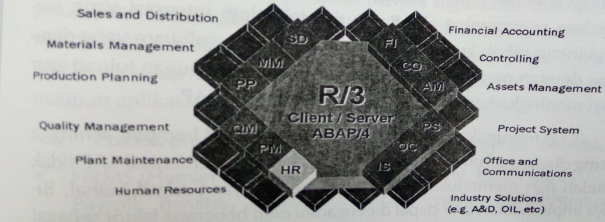
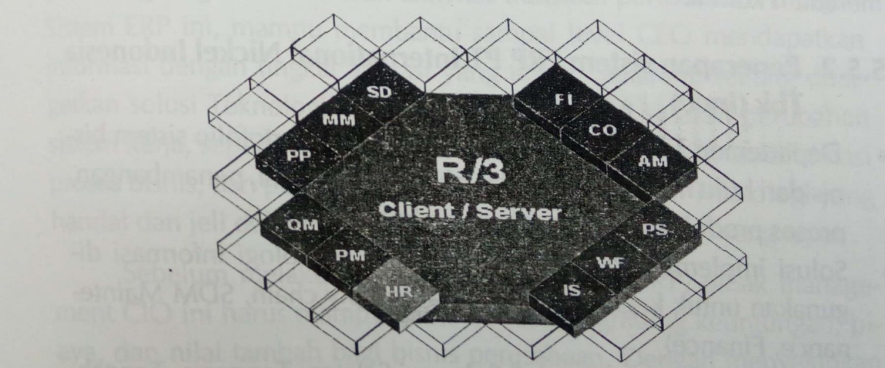
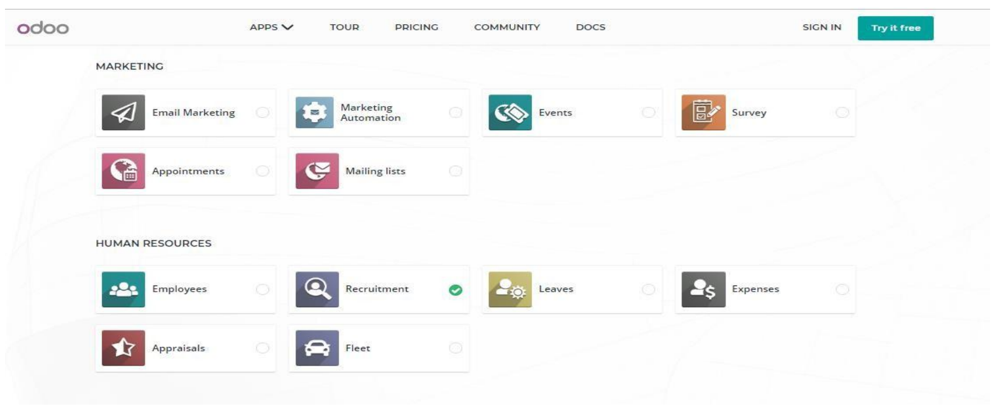
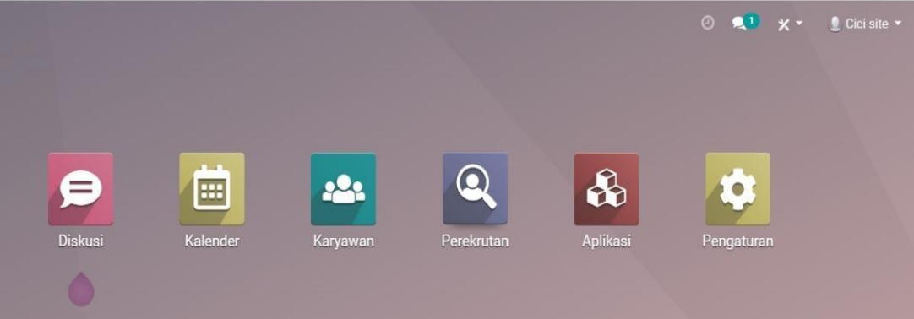
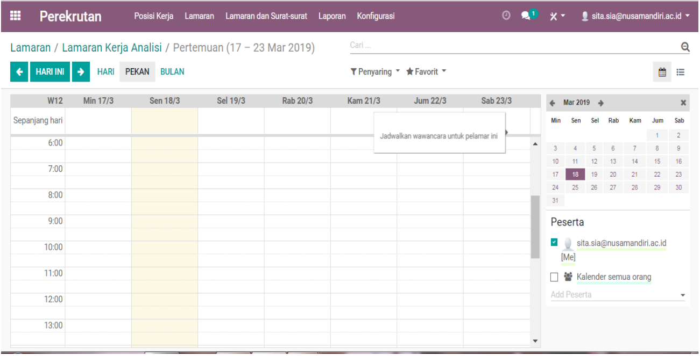
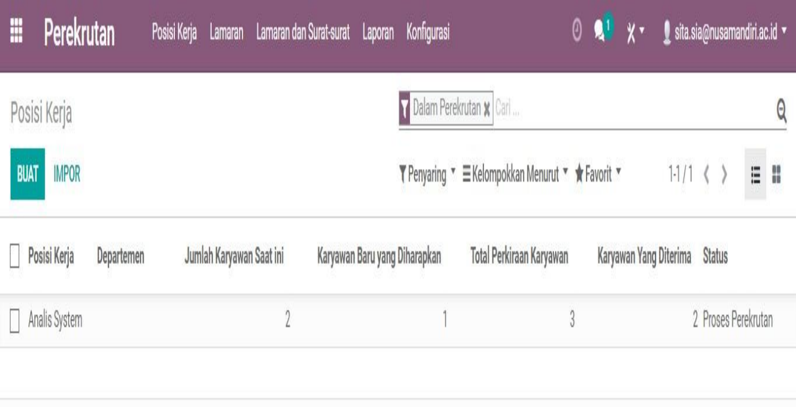

Saat ini, beredar bermacam – macam jenis software ERP dengan berbagai fitur, versi, skala, dan kemampuan, dgn menyediakan sistem ERP untuk berbagai jenis industry

## SAP

SAP merupakan salah satu sistem ERP yg popular diIndonesia. SAP didirikan sekitar 1975 dijerman oleh 5 orang mantan karyawan yg bekerja di IBM. SAP sebenarnya dari bahasa jerman yaitu System Andwendungen Produkteinder Datenverarbeitung atau dalam bahasa inggris singkatan SAP adalah Systems Applications Product in Data Processing.

SAP terdiri dari modul – modul yang terintegrasi, meliputi SAP ERP Enterprise Core, yaitu merupakan solusi aplikasi ERP, dan SAP Business Suite, yaitu merupakan paket aplikasi bisnis seperti SAP Customer Relationship Management, SAP Supply Chain Management, SAP supllier Relationship Management, SAP Product Lifecycle Management

- Pengguna aplikasi sistem ERP pada umumnya adalah perusahan mrenengah besar. SAP merupakan pemimpin pasar diseluruh dunia dgn penguasaan pasar mencapai 65%. SAP kini menyediakan paket solusi ERP untuk perusahaan menengah kecil, spt SAP Business One dan SAP All In One.

Di Indonesia, saat ini Sistem SAP banyak digunakan dalam berbagai kombinasi modul, fitur dan fasilitas oleh perusahaan besar spt : Garuda Indonesia, Telkom, PLN, Pertamina, Astra International, Astra Honda Motor, Indofood, Aqua Danone, Bentoel Prima, Bank mandiri, Ultra Jaya, Excelcomindo, Blue Bird, Nippon Indosari Corp, Ranch Market Indonesia, jamu Puspo, Zyrex, dll

### SAP System

Fungsi Utama dalam SAP ERP adalah :

Akuntansi Biaya, Akuntansi Manajemen, penjualan, Distribusi, Manufaktur, Perencanaan Produksi, Pengadaan , SDM, Penggajian

### Faktor yang mempengaruhi implementasi SAP

1. Kerangka Waktu
2. Orang
3. Hardware

## Software PeopleSoft

PeopleSoft adalah perusahaan software yg cukup lama berkembang dan produknya sudah banyak digunakan oleh berbagai perusahaan terkemuka didunia. Akuisisi peoplesoft oleh oracle makin menambah keberagaman produk oracle dan memperluas dukungan oracle tdhp semua pengguna produknya, baik produk database maupun aplikasi program.

### Product Software PeopleSoft

- HRMS (Human Resource Management Sistem), terdiri dari : Payroll, Benefits, Human Resource, Pension Administration, Time & labor
- Accounting and Control terdiri dari : General Ledger, payables, Receivables, Asset Managements, Project, Budgets, Expenses, Cash management
- Treasury Management
- Material Management
- Supply Chain Planning
- Service Revenue Management
- Enterprise Performance Management
- Procurement
- Project Management

## Oracle

Oracle corperation didirikan thn 1977 dan merupakan perusahaan software yg mengembangkan, membuat, memasarkan, emndistribusikan, dan melayani software database, dan infrastruktur software. Software yg dipasarkan meliputi application server, software kolaborasi, dan pengembangan. Sejak tahun 2004, perusahann oracle mengakuisis salah satu perusahaan pengembangan sistem ERP terkemuka, yaitu peoplesoft, sehingga perusahaan oracle harus mampu mendukung berbagai jenis produk dan terus mengembangkan produk dan layanannya.

### Oracle e-business suite

#### Financials :

- Planning (General Ledger, Analyzer)
- Analysis
- Consolidation
- Expenditure management
- Billing and Cash Collection
- Cash management
- Asset management

#### Supply Chain Management :

- Strategic Procurement
- Non- production Procerument
- Strategic souring
- Catalog Management

#### Project:

- Costing
- Billing
- Time and Expense
- Activity Management Gateway

#### Human Resources Material Management:

- Inventory
- Purchasing

#### Manufacturing :

- Factory dan Item Definition
- Planning & simulation
- Materials Management
- Production
- Cost Management
- Integrated Technologies

## Application Modules System Oracles

## Open Source ERP

Odoo merupakan salah satu penyedia jasa software ERP Odoo mempunyai dua macam versi , yakni yang pertama adalah versi komunitas dan yang kedua adalah versi enterprise. Versi pertama merupakan open source dan dapat kita lihat pada situs odoo.com secara langsung pada bagian community. Dan versi yang kedua merupakan versi yang eksklusif dan dapat dilihat pada situs Odoo tersebut. Software ini menyediakan software yang inutif, komplit, terintegrasi, dan pastinya open source bagi para penggunanya dalam kegiatan bisnis

- Berikut ini contoh trial pembuatan modul Human Resource dalam bagian Recruitment secara online
- Buka situs https://www.odoo.com/trial pilih bagian Human Resource dan pilih recruitment

- Tampilan dashboard Human Resource bagian recruitment akan seperti gambar dibawah ini :

- Tampilan jadwal dari kebutuhan recruitment dari Human resource akan tampil seperti gambar dibawah ini :

- Tampilan kebutuhan data modul recruitment adalah seperti gambar berikut ini :

