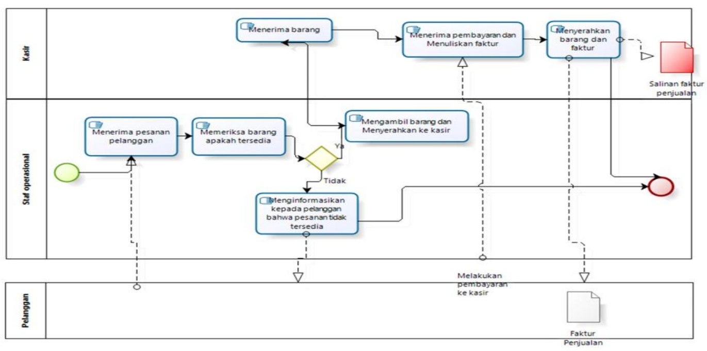
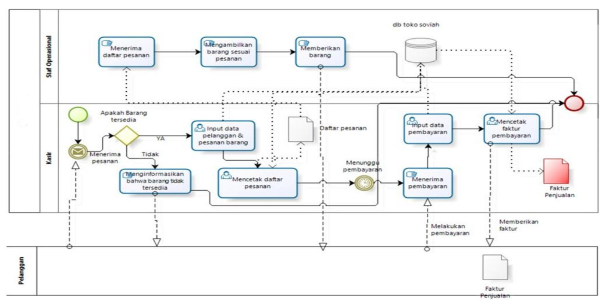
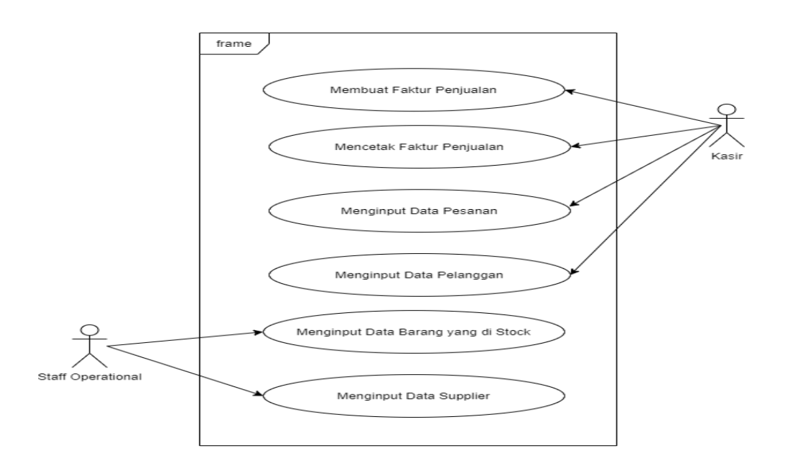

## Metode OOAD

- **OOAD (Object-Oriented Analysis and Design)**
- Merupakan suatu metode untuk menganalisis informasi mengenai contex system,dapat mendukung dalam menangani data dengan jumlah besar yang dapat didistribusikan ke departemen terkait, dan dengan pendekatan analisa, perancangan, user interface dan pemrograman yang berorientasi objek.
- Menggunakan UML dalam perancangan system informasinya

## Studi Kasus Penerapan ERP

- Berikut ini akan digambarkan penerapan ERP menggunakan Metode OOAD untuk **Sistem Penjualan (Sales & Distribution)**
- Diagram UML Yang digambarkan :
   Use Case Diagram
   Activity Diagram

## Contoh Proses Bisnis Sistem Berjalan Penjualan Sebelum Penerapan Odoo

## Contoh Use Case Modul Sales and Distribution

