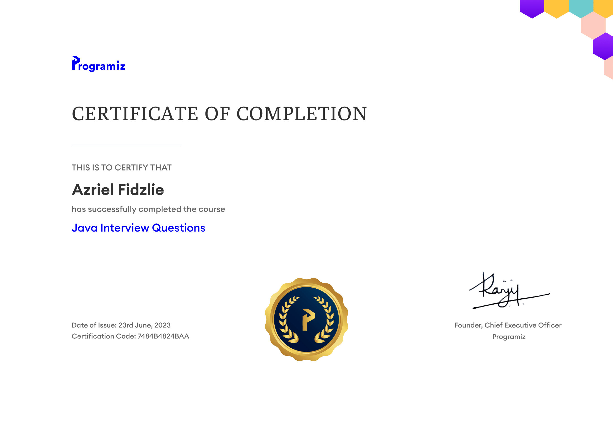
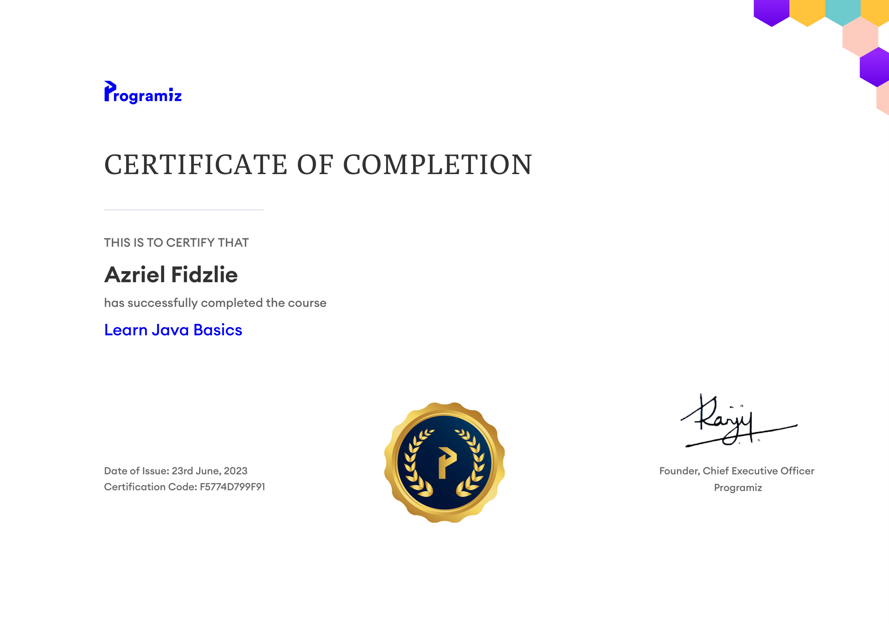
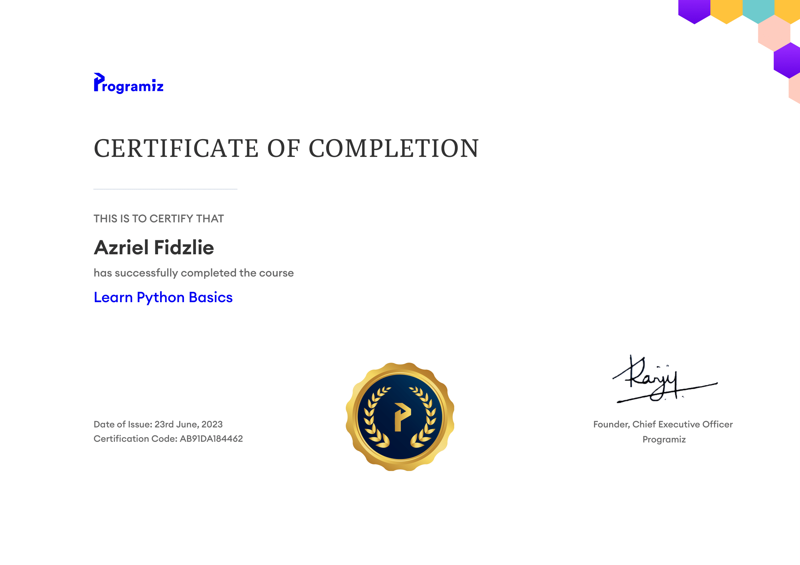
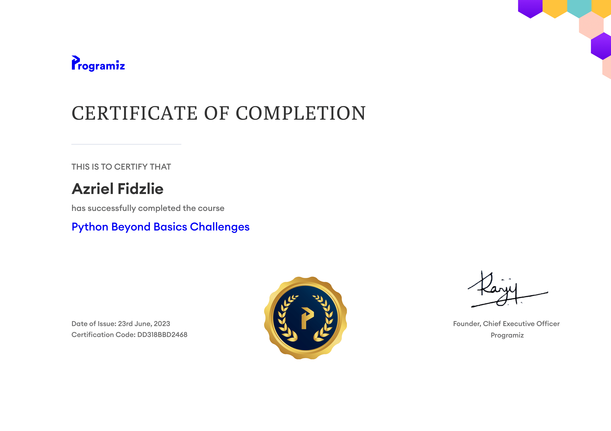

Menampilkan sertifikat yang saya peroleh.

## ERP (Enterprise Resource Planning) - 10 Januari 2026

Saya sangat bersyukur dan bangga bisa menyelesaikan Workshop Enterprise Resource Planning (ERP) yang diselenggarakan oleh PT. Sumihai Teknologi Indonesia. Melalui pelatihan ini, saya berhasil lulus Uji Kompetensi ERP dengan tingkat 'Proficient' dan meraih skor 97.50. Terima kasih kepada instruktur dan semua pihak yang telah mendukung proses belajar ini. Saya tidak sabar untuk mengimplementasikan ilmu ini di dunia profesional!

**Sumiati Pangat** 
Directur STI - PT. Sumihai Teknologi Indonesia 
www.sumihai.co.id

<iframe src="./ERP.pdf" width="100%" height="500" fitwidth="yes" frameborder="no" border="0" marginwidth="0" marginheight="0"></iframe>

## Sertifikat Kompetensi Analis Program - 15 September 2025

Sangat antusias untuk membagikan pencapaian terbaru saya! Saya telah resmi bersertifikasi kompetensi sebagai Analis Program (Program Analyst) oleh Badan Nasional Sertifikasi Profesi (BNSP).

Sertifikasi di bidang Pengembangan Perangkat Lunak ini merupakan validasi atas kemampuan dan komitmen saya dalam merancang, menganalisis, serta membangun sistem informasi yang handal dan terstruktur. Pencapaian ini semakin memotivasi saya untuk terus berinovasi dan memberikan solusi teknis terbaik dalam setiap proyek web development yang saya kerjakan ke depannya. Mari terus bertumbuh dan belajar!

<iframe src="./sertifikat_kompetensi.pdf" width="100%" height="500" fitwidth="yes" frameborder="no" border="0" marginwidth="0" marginheight="0"></iframe>

## Sertifikat IAII (Ikatan Ahli Informatika Indonesia) - 21 Januari 2023

Saya sangat senang membagikan pencapaian saya dalam meraih Sertifikat Profisiensi Pengetahuan di bidang Database Systems dari Ikatan Ahli Informatika Indonesia (IAII) dengan predikat Proficient.

Melalui sertifikasi ini, saya telah divalidasi memiliki pemahaman yang kuat mencakup desain database relasional, optimasi query tingkat lanjut, hingga arsitektur sistem penyimpanan data. Pencapaian ini memperkuat fondasi teknis saya sebagai pengembang web dalam merancang sistem back-end yang efisien, aman, dan dapat diskalakan. Terus semangat untuk belajar dan mengimplementasikan solusi database terbaik di setiap project yang saya kerjakan!

<iframe src="./Sertifikat_IAII.pdf" width="100%" height="500" fitwidth="yes" frameborder="no" border="0" marginwidth="0" marginheight="0"></iframe>

## Certificate of Completion - 23 Juni 2023

Saya sangat bangga untuk membagikan pencapaian saya dalam meraih Sertifikat Pelatihan "Java Interview Questions", "Learn Java Basics", "Learn Python Basics", dan "Python Beyond Basics Challenges" dari Programiz. Melalui pelatihan ini, saya telah memperoleh pemahaman yang kuat tentang dasar-dasar pemrograman Java, termasuk sintaksis, struktur data, dan konsep pemrograman berorientasi objek. Pencapaian ini semakin memperkuat fondasi teknis saya sebagai pengembang web dan memberikan saya keterampilan tambahan untuk mengembangkan aplikasi yang lebih kompleks di masa depan. Terus semangat untuk belajar dan mengembangkan keterampilan pemrograman saya!




