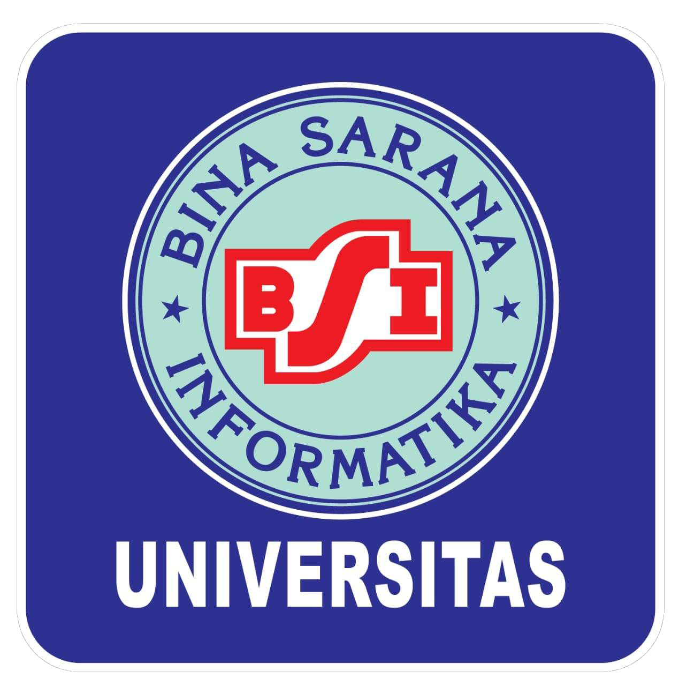

Menggeluti dunia teknologi dan pengembangan perangkat Lunak. Memiliki pengalaman programming, pengembangan web, dan sertifikasi yang relevan. Keterampilan komunikasi yang baik, Berpengalaman di bisnis kecil.

## Keterampilan


Data Analysis, HTML, CSS, JavaScript, PHP, Node.js, MySQL, Vue.js, Jaringan.


## Pengalaman Kerja

<table>
  <thead>
    <tr>
      <th>Company</th>
      <th>Company Name</th>
      <th>Role</th>
      <th>Description</th>
      <th>Dates</th>
      <th>Location</th>
    </tr>
  </thead>
  <tbody>
    <tr>
      <td>
        
      </td>
      <td>
        <a href="https://www.tvri.go.id/" target="_blank">
          TVRI Nasional
        </a>
      </td>
      <td>IT Brodcasting</td>
      <td>Monitoring Siaran TV, Menyalurkan Siaran Liputan, Mengikuti Liputan, dan
Mengoprasikan V-Mix.</td>
      <td>04/2025 - 07/2025</td>
      <td>Jakarta Pusat, Indonesia</td>
    </tr>
    <tr>
      <td>
        
      </td>
      <td>
        <a href="https://korbrimob.polri.go.id/" target="_blank">
          Korps Brimob Resimen III
        </a>
      </td>
      <td>Staf Administrasi</td>
      <td>Maintenance Elektronik, Penomoran surat, Membuat surat tugas operasi zebra, dan Mengirim surat.</td>
      <td>01/2021 - 03/2021</td>
      <td>Kota Depok, Jawa Barat, Indonesia</td>
    </tr>
  </tbody>
</table>

## Sertifikat

**** Workshop and successful completion of the ERP Competency Test conducted 
**** Sertifikat BNSP Kompetensi Analis Program Pengembangan Perangkat Lunak 
**** Sertifikat IAII Database Systems Profisiensi Pengetahuan 
**** Certificate of Completion: Java Interview Questions, Learn Java Basics, Learn Python Basics, dan Python Beyond Basics Challenges


 Transkrip


## Pendidikan

<table>
  <thead>
    <tr>
      <th>School</th>
      <th>Link</th>
      <th>Degree</th>
      <th>Date</th>
    </tr>
  </thead>
  <tbody>
    <tr>
      <td>
        
      </td>
      <td>
        <a href="https://www.ubsi.ac.id/" target="_blank">
          Universitas Bina Sarana Informatika
        </a>
      </td>
      <td>Sistem Informasi</td>
      <td>2022 - 2026</td>
    </tr>
  </tbody>
</table>

## Unduh

Anda dapat melihat resume saya di FlowCV atau langsung mengunduh file PDF-nya.


 Flow CV

&nbsp;&nbsp;

 Unduh

